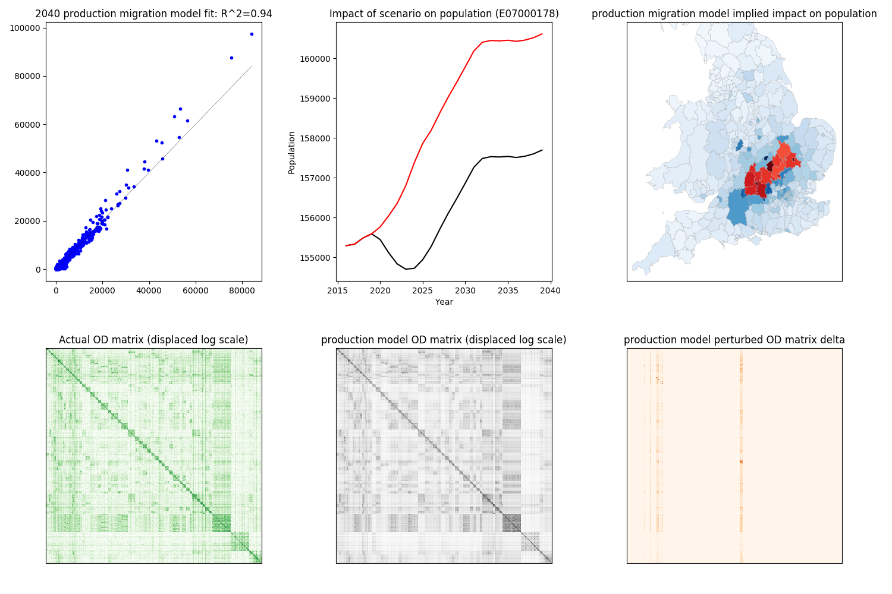
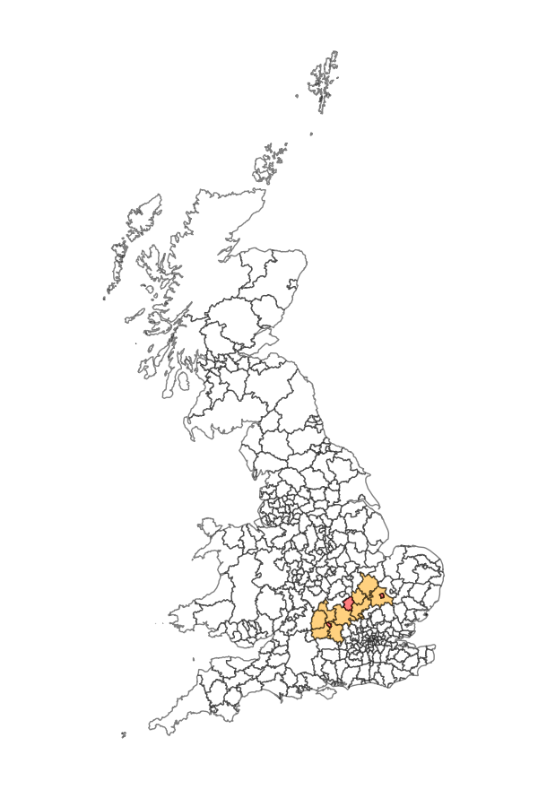

 
# simim - Spatial Interaction Models of Internal Migration

** **work-in-progress** **

### Example

_Figure 1. Example of gravity (unconstrained), attraction-constrained and doubly-constrained fits to 2011 census OD, population and household count data by LAD.  The axes in the scatterplots are number of migrations (x actual, y model). The OD matrix delta here is the difference in the model computed OD matrix given 20000 new household spaces in each of 13 local authorities in the CaMKOx corridor._

The above models fit poorly because they use only population (as the emitter) and household count (as the attractor) and the cost function is based on Euclidean distance between LAD centroids. 

This package aims to address these shortcomings by developing a more sophisticated model or models with multiple, configurable factors influencing production and attraction.

Once a model has been established with a good fit to the data, the model can then be used to examine the (national) impact on migration of significant changes to infrastructure. As in the example illustrated above, changing the attractiveness parameters at a particular location or locations will result in the model producing a modified OD matrix. This data can then be used to create custom population projection variants at a subnational scale. These variant projections can then be integrated into the [ukpopulation](https://github.com/nismod/ukpopulation) package.

Note that although all the base models are constrained to the total number of migrations, applying changes to the emissiveness or attractiveness values will not in general conserve the total. Thus the migrations can be increased or decreased in this methodology.

The primary case study for this work will be the proposed east-west arc [[1]](#references) (a.k.a. Cambridge-Milton Keynes-Oxford corridor).

_Figure 2. East-west arc in context of GB. Cambridge, Milton Keynes and Oxford in red. LADs included in the arc are subject to change._

# References
[1] National Infrastructure Commission, 2017, [Growth Arc – Completed Study](https://www.nic.org.uk/our-work/growth-arc/)

[2] Oshan, T (2016), [_A primer for working with the Spatial Interaction modeling (SpInt) module in the python spatial analysis library (PySAL)_](http://openjournals.wu.ac.at/region/paper_175/175.html) 
