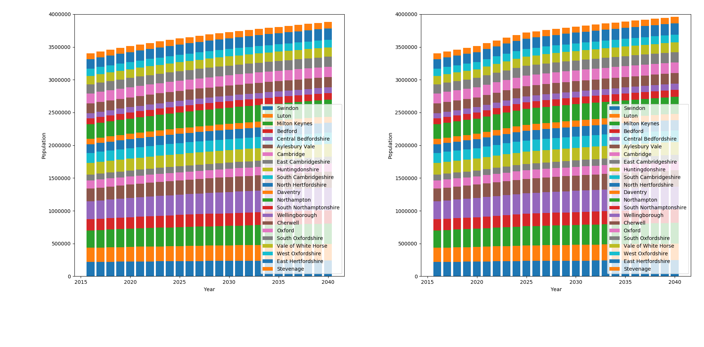

[](https://travis-ci.org/nismod/simim) [](https://opensource.org/licenses/MIT) [](https://zenodo.org/badge/latestdoi/159637047)
# simim - Spatial Interaction Models of Internal Migration

** **work-in-progress** **

# Introduction

This package aims to build a flexible custom population projection generation tool based on spatial interaction models of internal migration within the UK (probably GB only). The tool is intended to be used to model the impact of large and long-term infrastructure changes on population distribution and growth.

The rationale is to take an official population projection (baseline or variant), internal migration data, and additional official figures for factors that may govern migration (employment, housing, GVA etc). The next step is to construct a spatial interaction model of internal migration from this data that meets some (arbitrary) goodness-of-fit criteria. 

Following this, a scenario must be invented that captures some change or changes given by, for example, a future infrastructure project such as increasing the housing stock and jobs and in a specific region. By reapplying the model to the original input data with the scenario applied, a modified migration O-D matrix is generated.

Finally, the change to the O-D matrix can be applied to the original population projection to create a custom variant. The nature of the model means that localised changes have a global impact - so the new variant projection applies to the whole country.

Scenarios can be cumulatively applied over a number of years, e.g. for a 5-year house-building programme. Each subsequent year should use the previous years data *with the scenario applied* as a starting point.

Once a model has been established with a good fit to the data, the model can then be used to examine the (national) impact on migration of significant changes to infrastructure. As in the example illustrated above, changing the attractiveness parameters at a particular location or locations will result in the model producing a modified OD matrix. This data can then be used to create custom population projection variants at a subnational scale. These variant projections can then be integrated into the [ukpopulation](https://github.com/nismod/ukpopulation) package.

Note that although all the base models are constrained to the total number of migrations, applying changes to the emissiveness or attractiveness values will not in general conserve the total. Thus the migrations can be increased or decreased in this methodology. Additionally, attraction- or doubly-constrained models are not suitable here as they do not allow for changes to attractiveness once the model has been calibrated. Even production-constrained models are a limitation as the model progresses through time, since the increased migrations from a particular LAD should decrease over time to reflect that the population of the LAD is shrinking (or lower than the official projection).

The primary case study for this work will be the proposed east-west arc [[1]](#references) (a.k.a. Cambridge-Milton Keynes-Oxford corridor).

## Caveats
- the model can only be as good as the input data - not all input datasets are recent. The latest know dataset that captures intra-LAD migrations (which may become inter- under some scenario) is the 2011 census.
- the model as it stands cannot capture the possibility of a wider impact of specific scenario: in other words, the attractiveness of a LAD could easily be influenced by new jobs in a neighbouring LAD. See [Further Development](#further-development)  
- the model assumptions are quite simplistic, although inclusion of multiple emission/attraction factors can help.
- the methodology cannot capture changes in fertility, mortality and international migration that a scenario might be expected to affect.
- the delta in migrations between the model under the scenario and the model under the baseline - which is key to generating the custom projection - is upscaled by the ratio of the total population in the LAD and the proportion that migrated in the previous year. This scaling produces changes in migration of the expected order of magnitude (given the housing/empoyment changes), but has yet to be fully justified.

## Further Development

### Generalised Employment Accessibility

The limitation (mentioned in [Caveats](#caveats) above) that scenario changes can only influence the LAD in which they occur pervents the model from capturing effects such as the attractiveness of a particular LAD (as a place to live) may increase due to changes in neighbouring LADs (such as more jobs).

This effect can be modelled by using, for example, a generalised 'job accessibility' measure, rather than absolute jobs, in the model. Typically this would be a cost-weighted sum of all employment in the entire country, with the cost a measure of commutability (travel time and/or cost). This can simply be added by multiplying the absolute job counts by an OD matrix of generalised costs. (Southampton have provided road but not rail data for this).

Furthermore, this generalised job accessibility measure allows transport scenarios to be incorporated into the model. For example, the impact of an Oxford-Cambridge expressway could be expressed as a change to the commute cost OD matrix: values for trips between LADs along the route will be reduced.

Thus a scenario where only jobs in Cambridge are increased would have no significant impact on say Oxford, since commuting between the two is not feasible with the current infrastructure. However, a scenario which also incudes a significant reduction in commute cost would see an impact on Oxford's attractiveness as a place to live. 

For this to be implemented requires a cost matrix that incorporates all forms of travel. Crucially, rail travel cost data has not yet been provided.

### Justification of the migration delta scaling

A convincing argument needs to be made to justify the upscaling of the change in migration caused by the scenario described in the [Caveats](#caveats) section. 

### Updated Scenarios using new definition of region

LADs in region has been redefined. Cambridge Econometrics are providing updated scenarios.

# Example

## Scenario

New housing across the region, new jobs in the three centres (Oxford, Cambridge, Milton Keynes) over the period 2020-2024, result in e.g. about 10000 new household spaces and 50000 jobs in Oxford.

The full scenario dataset is [here](data/scenarios/test.csv).

## Results


_Figure 1. Illustrative example of a production-constrained fit to internal migration, population and household count data by LAD.  The axes in the scatterplot are number of migrations (x actual, y model). The line plot is the total population of Oxford (LAD) - baseline projection (black) and scenario-modified projection (red). The map shows where the changed migration reduces the population (blue) and increases it (red). The OD matrix delta here is the difference in the model computed OD matrices with and without a scenario where jobs are created in the centres (Oxford, Milton Keynes, Cambridge) and household spaces are created across the CaMKOx corridor over the period 2020-2024._


_Figure 2. Stacked bar charts of the populations of the CaMKOx constituent LADs over the simulation timeline. The graph on the left shows the baseline subnational population projects whilst the graph on the right shows the impact of the scenario described above._


The above models are still under development and more work needs to be done to choose the optimal emitter and attractor categories, use more up-to-date housing data, plus investigate different cost functions (currently a displaced Euclidean distance between LAD centroids). The changes in population from the model is much smaller than would be expected given the scenario applied.

To run this example (see installation instructions below, then):

```bash
(.venv) $ scripts/run.py -c config/gravity.json
```
The example configuration file can be found [here](config/gravity.json).

# Data Requirements
- ONS sub-national population projections
- ONS sub-national housing projections
- Employment and/or related data (e.g. GVA)
- Internal migration data (LAD level)
- Other emissiveness/attractiveness factors as necessary
- **Specific modifications to the some or all of the above that describe a specific infrastructure scenario.**

# Scenarios

** awaiting updated scenarios from Cambridge Econometrics **

## Geography

The scenarios described below apply to all or part of the "CaMKOx" region defined by the following LADs:

| Code    | Name                   |
| ------- | ---------------------- |
|E07000008|Cambridge
|E07000177|Cherwell
|E07000099|North Hertfordshire
|E06000055|Bedford
|E06000056|Central Bedfordshire
|E07000012|South Cambridgeshire
|E06000032|Luton
|E07000179|South Oxfordshire
|E07000004|Aylesbury Vale
|E07000180|Vale of White Horse
|E07000181|West Oxfordshire
|E07000155|South Northamptonshire
|E06000042|Milton Keynes
|E07000178|Oxford
|E06000030|Swindon
|E07000151|Daventry
|E07000154|Northampton
|E07000156|Wellingborough
|E07000009|East Cambridgeshire
|E07000242|East Hertfordshire
|E07000011|Huntingdonshire
|E07000243|Stevenage

In the baseline (principal variant) projection, the population of this region grows from ~3.4M in 2016 to ~4.0M in 2050.

All scenarios are defined as variations to the baseline household and/or population projections. Thus a value of 100 households for a particular area and year represents an increase of 100 new households spaces _over and above_ the projection for that year. 

## Scenario 1: Five new towns

### Definition

Over the period 2020-2050, the net addition of existing household spaces is reduced to 70% of the projection. The deficit, plus an extra 20000 household spaces, is allocated annually to five new towns in the following Local Authority Districts: Aylesbury Vale (2), Central Bedfordshire, South Cambridgeshire, Huntingdonshire.

[dataset](data/scenarios/scenario1.csv)

Population estimate (2050): 5.3M

### Model Results

Housing increase over projection (2050):

Population (2050): 

## Scenario 2: Expansion

### Definition

In this scenario, over the period 2020-2050 some existing settlements are expanded over and above the baseline household projection. All other areas follow the projection. The annual extra ~20000 household spaces are allocated as follows: 

| LAD(s)                           | Allocation |
| -------------------------------- | ---------- |
| Oxford, Milton Keynes, Cambridge | 25%        |
| Bedford                          | 10%        |
| Northamption, Luton, Stevenage   | 5%         |

[dataset](data/scenarios/scenario2.csv)

Population estimate (2050): 5.3M

### Model Results

Population (2050): 

## Scenario 1 and 2 "J" Variant

These variants add jobs as a second attractiveness factor, exactly in line with the placement of household spaces with a ratio of 1 job per household space. 

Whilst an increase in a household space will by definition increase migration to the LAD in which they are build, employment is more complex as people can work in a place that is different to where they live, especially if there are good transport links. A spatial interaction model should not use "jobs in LAD" as an attractor, rather a broader measure of the accessibility of jobs in that LAD (or, ideally, smaller geography)

# Installation

[only tested on ubuntu 18.04LTS]

First non-python deps can be installed thus:
```
$ sudo apt install proj-bin libproj-dev libgeos-3.6.2 libgeos-dev python3-tk
```
(NB travis installs gdal-bin, libgdal-dev, libproj-dev  OS is 16.04)
Then (use of virtualenv* recommended),
```
$ pip install -r requirements.txt
$ ./setup.py install
$ ./setup.py test
```

&ast; conda will be supported at some point (it may already work but hasn't been tested)

# References
[1] National Infrastructure Commission, 2017, [Growth Arc - Completed Study](https://www.nic.org.uk/our-work/growth-arc/)

[2] Oshan, T (2016), [_A primer for working with the Spatial Interaction modeling (SpInt) module in the python spatial analysis library (PySAL)_](http://openjournals.wu.ac.at/region/paper_175/175.html) 
